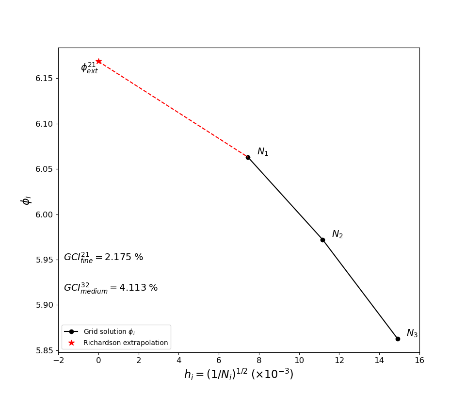
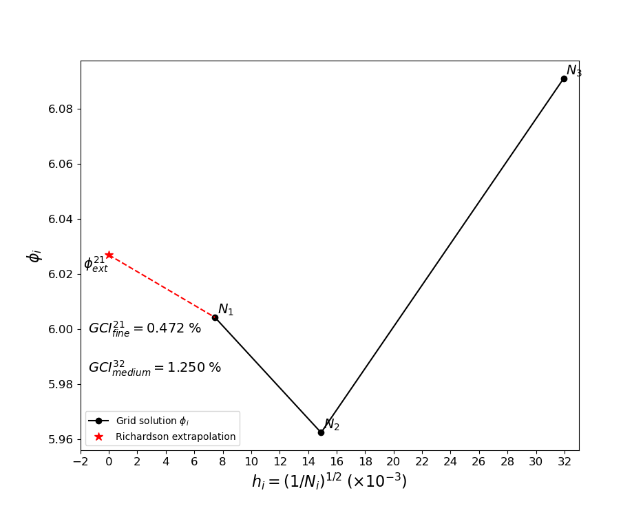

# Grid Convergence Index (GCI)

This code applies the Grid Convergence Index (GCI) method to quantify the grid error for Computational Fluid Dynamics (CFD) applications.

The program asks the user the following:

1. The dimensions of the problem/grid, i.e., 1D, 2D or 3D.
2. The grid's number of cells for the fine, medium and coarse grids.
3. The CFD solution for the fine, medium and coarse grids.

Main program scripts description:

- The file ```gci/gci_no_prompt.py``` is intended for users who prefer to change the input parameters directly in the source code.
- The file ```gci/gci_prompt.py``` is inteded for users who prefer to be prompted for the input parameters when the code is executed,
  or possibly to create an executable with the ladder file.


## Clone repository

Using git, copy and paste the following command in the terminal:

```shell
git clone https://github.com/oscar-monsalve/GCI.git
cd GCI
```

Dependencies:

- prettytable
- matplotlib
- pytest (optional for testing).

To install dependencies, run the following terminal command:

```shell
pip install -r requirements.txt
```

Run the main program scripts. If the Operating System is Windows, run with `python`. Otherwise, for Linux systems in general:

```shell
python3 gci/gci_no_prompt.py
```

or

```shell
python3 gci/gci_prompt.py
```

## Examples

1. The following case corresponds to a 2D grid with **monotonic convergence**. The input comes from ASME's article on
["Procedure for Estimation and Reporting of Uncertainty Due to Discretization in CFD Applications"](https://doi.org/10.1115/1.2960953).

Change the following variables at ```gci/gci_no_prompt.py```. The variable `desired_gci` is set to None for now:

```python
dimension:            str = "2"
n1:                   int = 18000
n2:                   int = 8000
n3:                   int = 4500
phi1:               float = 6.063
phi2:               float = 5.972
phi3:               float = 5.863
desired_gci: float | None = None
```

Execute the script with:

```shell
python3 gci/gci_no_prompt.py
```

The results are presented with table and a plot:


```shell
(OK) Monotonic convergence. Convergence ratio e_21/e32: 0.8349.

Grid Convergence Index (GCI) results:
+-----------------------+---------+---------------------------------------------------------------------------+
| Parameters            | Results | Description                                                               |
+-----------------------+---------+---------------------------------------------------------------------------+
| N1                    | 18000   | Fine grid cell count                                                      |
| N2                    | 8000    | Medium grid cell count                                                    |
| N3                    | 4500    | Coarse grid cell count                                                    |
| r21                   | 1.5000  | Medium-to-fine refinement factor                                          |
| r32                   | 1.3333  | Coarse-to-medium refinement factor                                        |
| phi1                  | 6.0630  | Fine grid numerical solution                                              |
| phi2                  | 5.9720  | Medium grid numerical solution                                            |
| phi1                  | 5.8630  | Coarse grid numerical solution                                            |
| p                     | 1.5340  | Aparent oder                                                              |
| phi_ext               | 6.1685  | Extrapolated solution                                                     |
| e_21_a (%)            | 1.5009  | Medium-to-fine approximate relative error                                 |
| e_32_a (%)            | 1.5009  | Coarse-to-medium approximate relative error                               |
| e_21_ext (%)          | 1.7102  | Medium-to-fine extrapolated relative error                                |
| e_32_ext (%)          | 3.1855  | Coarse-to-medium extrapolated relative error                              |
| GCI_21_fine (%)       | 2.1750  | Fine grid convergence index result                                        |
| GCI_32_medium (%)     | 4.1129  | Medium grid convergence index result                                      |
| Asymptotic_range (AR) | 0.9850  | AR~1 indicates mesh convergence and minimal gain from further refinement. |
+-----------------------+---------+---------------------------------------------------------------------------+
```
<figure>
    
    <figcaption>Figure 1. Monotonic convergence case plot result.</figcaption>
    <br>
</figure>

<br>

If `desired_gci` is set to a desired GCI percentage value, say `2%`:

```python
dimension:            str = "2"
n1:                   int = 18000
n2:                   int = 8000
n3:                   int = 4500
phi1:               float = 6.063
phi2:               float = 5.972
phi3:               float = 5.863
desired_gci: float | None = 2.0
```

The result table will show at the last row the required grid cells to achieve the aforementioned desired GCI as `"N_required"`.
Note that this results has to be greater than the previous refined cell count `N1`.

```shell
(OK) Monotonic convergence. Convergence ratio e_21/e32: 0.8349.

Grid Convergence Index (GCI) results:
+-----------------------+---------+---------------------------------------------------------------------------+
| Parameters            | Results | Description                                                               |
+-----------------------+---------+---------------------------------------------------------------------------+
| N1                    | 18000   | Fine grid cell count                                                      |
| N2                    | 8000    | Medium grid cell count                                                    |
| N3                    | 4500    | Coarse grid cell count                                                    |
| r21                   | 1.5000  | Medium-to-fine refinement factor                                          |
| r32                   | 1.3333  | Coarse-to-medium refinement factor                                        |
| phi1                  | 6.0630  | Fine grid numerical solution                                              |
| phi2                  | 5.9720  | Medium grid numerical solution                                            |
| phi1                  | 5.8630  | Coarse grid numerical solution                                            |
| p                     | 1.5340  | Aparent oder                                                              |
| phi_ext               | 6.1685  | Extrapolated solution                                                     |
| e_21_a (%)            | 1.5009  | Medium-to-fine approximate relative error                                 |
| e_32_a (%)            | 1.5009  | Coarse-to-medium approximate relative error                               |
| e_21_ext (%)          | 1.7102  | Medium-to-fine extrapolated relative error                                |
| e_32_ext (%)          | 3.1855  | Coarse-to-medium extrapolated relative error                              |
| GCI_21_fine (%)       | 2.1750  | Fine grid convergence index result                                        |
| GCI_32_medium (%)     | 4.1129  | Medium grid convergence index result                                      |
| Asymptotic_range (AR) | 0.9850  | AR~1 indicates mesh convergence and minimal gain from further refinement. |
| N_required            | 18498   | Required cells for a desired GCI value of 2.00%                           |
+-----------------------+---------+---------------------------------------------------------------------------+
```

2. Next case corresponds to a 2D grid with **oscillatory convergence**. The input comes from ASME's article on
 ["Procedure for Estimation and Reporting of Uncertainty Due to Discretization in CFD Applications"](https://doi.org/10.1115/1.2960953).

Change the following variables at ```gci/gci_no_prompt.py```. The variable `desired_gci` is set to None.

```python
dimension:            str = "2"
n1:                   int = 18000
n2:                   int = 4500
n3:                   int = 980
phi1:               float = 6.0042
phi2:               float = 5.9624
phi3:               float = 6.0909
desired_gci: float | None = None
```

Execute the script with:

```shell
python3 gci/gci_no_prompt.py
```

The results are presented with table and a plot:


```shell
WARNING:root:Oscillatory convergence detected. Convergence ratio e_21/e32: -0.3253. For this case, the GCI results
might be fine, but sometimes it could increase the uncertainty of the results.
WARNING:root:If the GCI results are not satisfactory, it is recommended to remesh and aim for monotonic convergence.

Grid Convergence Index (GCI) results:
+-----------------------+---------+---------------------------------------------------------------------------+
| Parameters            | Results | Description                                                               |
+-----------------------+---------+---------------------------------------------------------------------------+
| N1                    | 18000   | Fine grid cell count                                                      |
| N2                    | 4500    | Medium grid cell count                                                    |
| N3                    | 980     | Coarse grid cell count                                                    |
| r21                   | 2.0000  | Medium-to-fine refinement factor                                          |
| r32                   | 2.1429  | Coarse-to-medium refinement factor                                        |
| phi1                  | 6.0042  | Fine grid numerical solution                                              |
| phi2                  | 5.9624  | Medium grid numerical solution                                            |
| phi1                  | 6.0909  | Coarse grid numerical solution                                            |
| p                     | 1.5077  | Aparent oder                                                              |
| phi_ext               | 6.0269  | Extrapolated solution                                                     |
| e_21_a (%)            | 0.6962  | Medium-to-fine approximate relative error                                 |
| e_32_a (%)            | 0.6962  | Coarse-to-medium approximate relative error                               |
| e_21_ext (%)          | 0.3762  | Medium-to-fine extrapolated relative error                                |
| e_32_ext (%)          | -1.0101 | Coarse-to-medium extrapolated relative error                              |
| GCI_21_fine (%)       | 0.4720  | Fine grid convergence index result                                        |
| GCI_32_medium (%)     | 1.2499  | Medium grid convergence index result                                      |
| Asymptotic_range (AR) | 1.0739  | AR~1 indicates mesh convergence and minimal gain from further refinement. |
+-----------------------+---------+---------------------------------------------------------------------------+
```
<figure>
    
    <figcaption>Figure 2. Oscillatory convergence case plot result.</figcaption>
    <br>
</figure>

<br>


## TODO

- [x] Add warnings for refinement ratio (r>1.3).
- [x] Add calculations for 1D geometries.
- [x] Add convergence condition (monotonic convergence, oscillatory conv, etc). If divergent print warning.
- [x] Add asymptotic range (calculate only if r21 = r32).
- [x] Add GCI results within the plot
- [x] Add python libs requirements in a .txt file.
- [x] Calculate desired number of cell for a dersired GCI value.
- [ ] Add calculation for local GCI to report error bars on a result along a plane/profile/surface (Last part of Celik, et al.)
- [ ] Add latex, word, markdown tables for reporting results.
- [ ] Calculate results for more than one CFD solution at a time.
- [ ] Add calculations for variable length, area or volume for the simulation domain.
